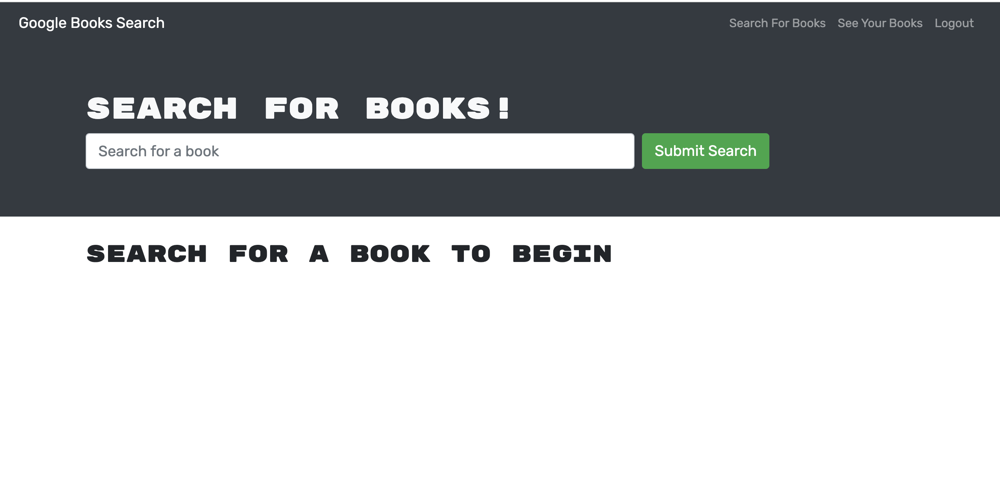
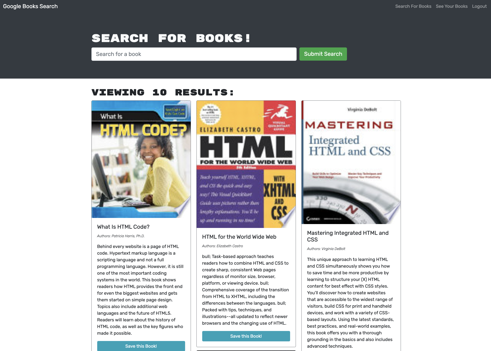
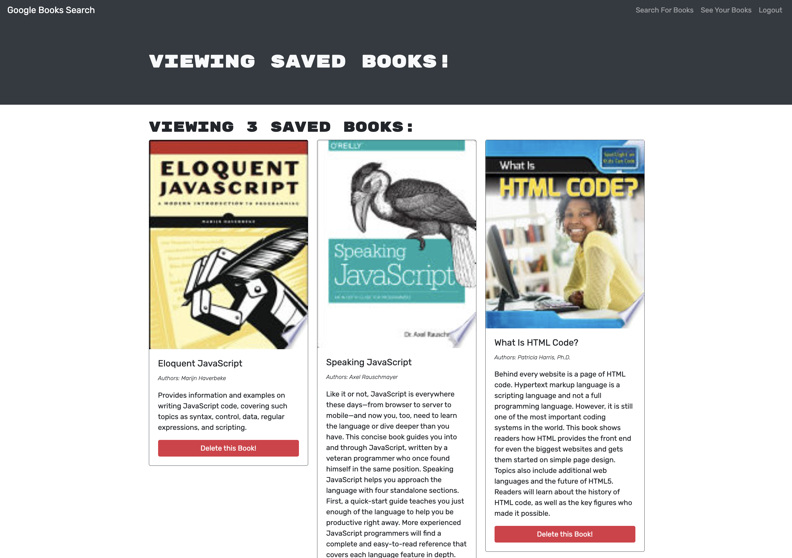
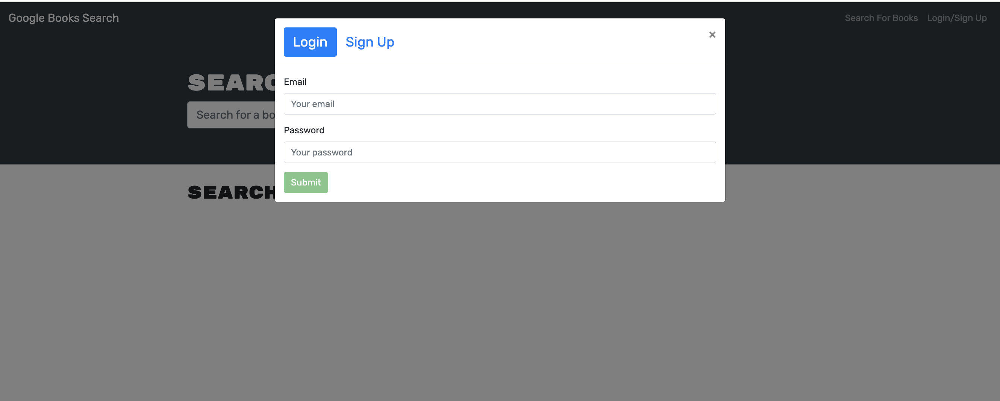

# MERN Challenge: Book Search Engine

In this Challenge, we were asked to take a fully functioning Google Books API search engine built with a RESTful API, and refactor it to be a GraphQL API built with Apollo Server. The app was built using the MERN stack, with a React front end, MongoDB database, and Node.js/Express.js server and API. It's already set up to allow users to save book searches to the back end.

In this Challenge, we were asked to: 
* set up an Apollo Server to use GraphQL queries and mutations to fetch and modify data, replacing the existing RESTful API. 
* to modify the existing authentication middleware so that it works in the context of a GraphQL API. 
* to create an Apollo Provider so that requests can communicate with an Apollo Server.

This application was deployed to Render.

## URLs Submitted:

* GitHub Repo URL: https://github.com/lenzlee/booksearch-engine

* URL of the functional, deployed application on Render: https://booksearch-engine-yuwi.onrender.com

## References and Resources: 
I mostly used our Module 21 lessons for this assignment. I also referred to the following resources:

Starter Code Repo: https://github.com/coding-boot-camp/solid-broccoli

Apollo Client: https://www.apollographql.com/docs/react/

GraphQL: https://graphql.com/learn/what-is-graphql/

Render: https://docs.render.com/deploys

express.js: https://www.npmjs.com/package/express

Mongoose: https://www.npmjs.com/package/mongoose

## How To Install This App:

STEP 1: Clone my GitHub repository by typing in your terminal:
```
git clone git@github.com:lenzlee/booksearch-engine.git
```

STEP 2: Perform *npm install* on the root directory, the client directory, and the server directory by typing in your terminal:
```
cd into the root directory
npm install

cd into the client directory
npm install

cd into the server directory
npm install
```

STEP 3: Run the app locally by typing in your terminal:
```
npm run develop
```

## User Story:

```
AS AN avid reader
I WANT to search for new books to read
SO THAT I can keep a list of books to purchase
```

## Acceptance Criteria:

```
GIVEN a book search engine
WHEN I load the search engine
THEN I am presented with a menu with the options Search for Books and Login/Signup and an input field to search for books and a submit button
WHEN I click on the Search for Books menu option
THEN I am presented with an input field to search for books and a submit button
WHEN I am not logged in and enter a search term in the input field and click the submit button
THEN I am presented with several search results, each featuring a book’s title, author, description, image, and a link to that book on the Google Books site
WHEN I click on the Login/Signup menu option
THEN a modal appears on the screen with a toggle between the option to log in or sign up
WHEN the toggle is set to Signup
THEN I am presented with three inputs for a username, an email address, and a password, and a signup button
WHEN the toggle is set to Login
THEN I am presented with two inputs for an email address and a password and login button
WHEN I enter a valid email address and create a password and click on the signup button
THEN my user account is created and I am logged in to the site
WHEN I enter my account’s email address and password and click on the login button
THEN I the modal closes and I am logged in to the site
WHEN I am logged in to the site
THEN the menu options change to Search for Books, an option to see my saved books, and Logout
WHEN I am logged in and enter a search term in the input field and click the submit button
THEN I am presented with several search results, each featuring a book’s title, author, description, image, and a link to that book on the Google Books site and a button to save a book to my account
WHEN I click on the Save button on a book
THEN that book’s information is saved to my account
WHEN I click on the option to see my saved books
THEN I am presented with all of the books I have saved to my account, each featuring the book’s title, author, description, image, and a link to that book on the Google Books site and a button to remove a book from my account
WHEN I click on the Remove button on a book
THEN that book is deleted from my saved books list
WHEN I click on the Logout button
THEN I am logged out of the site and presented with a menu with the options Search for Books and Login/Signup and an input field to search for books and a submit button
```

## Screenshots:

* Screenshot 1: Homepage



* Screenshot 2: Book Search



* Screenshot 3: Saved Books



* Screenshot 4: Login/SignUp Modal



## Contact Me
Lenzlee Wheeler at: https://github.com/lenzlee 